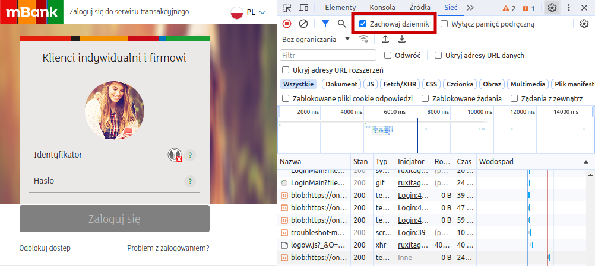
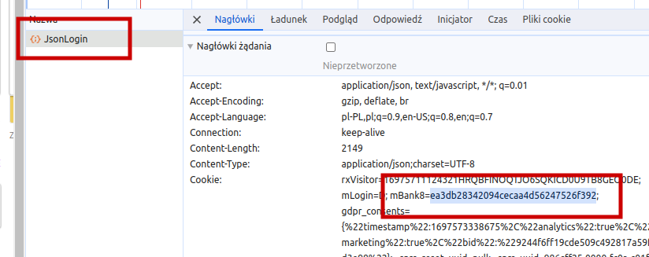
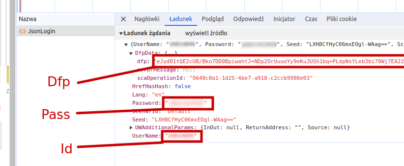

## mbank-cli-go

This app allows to scrap mBank accounts data includes current balance.

```bash
docker run --rm --env-file .env.local rjablecki/mbank-go-cli
```

App returns output in JSON format. Example:

```json
[
    {
        "accountNumber": "68 0000 0000 0000 0000 0000 0000",
        "balance": 123456.74,
        "currency": "PLN",
        "name": "eKonto",
        "customName": "jan"
    }
]
```

## Credentials

App require env variable with name `MBANK_CREDENTIALS`. It is base64 encoded json file with login, and browser data. Example

```json
{
    "Dfp":"xxxxx",
    "Id":11111,
    "Mbank8":"xxxxx",
    "Pass":"xxxxx",
    "UserAgent":"Mozilla/5.0 (X11; Linux x86_64) AppleWebKit/537.36 (KHTML, like Gecko) Chrome/119.0.0.0 Safari/537.36"
}
```

### How to get your own credentials

Create file `my-credentials.json` with content like upper JSON example,or use repository files:

```bash
git clone git@github.com:rjablecki/mbank-go-cli.git
cd mbank-go-cli
cp credentials.json my-credentials.json 
```

Go to https://online.mbank.pl/pl/Login in browser and run `F12` to open dev tools. Click `Preserve log` checkbox to prevent clear requests after page refresh.



Enter your login, password and click `Log in`. 

Search request with name `JsonLogin` and click on it. Scrol down to find value of cookie with name `mBank8`.  Copy value to `my-credentials.json` as `Mbank8`




Click next tab `Payload` and here you find data to fill `Id` `Pass` and `Dfp`



Go to console and type `navigator.userAgent` to get your userAgent.


After fill data in `my-credentials.json` you can finally create app credentials - `.env.local`

```bash
echo MBANK_CREDENTIALS=$(cat my-credentials.json | base64 -w 0) > .env.local
```
